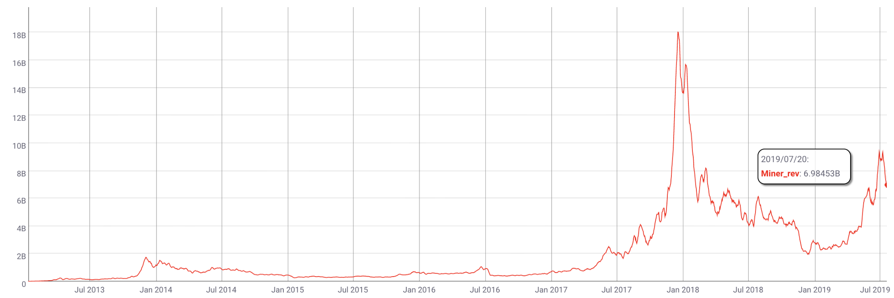
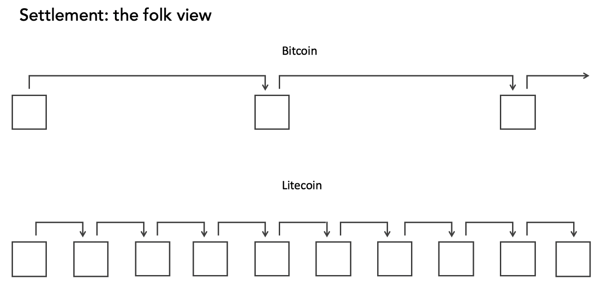
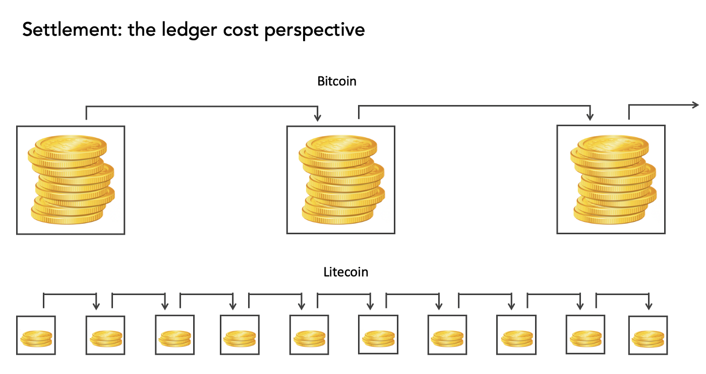
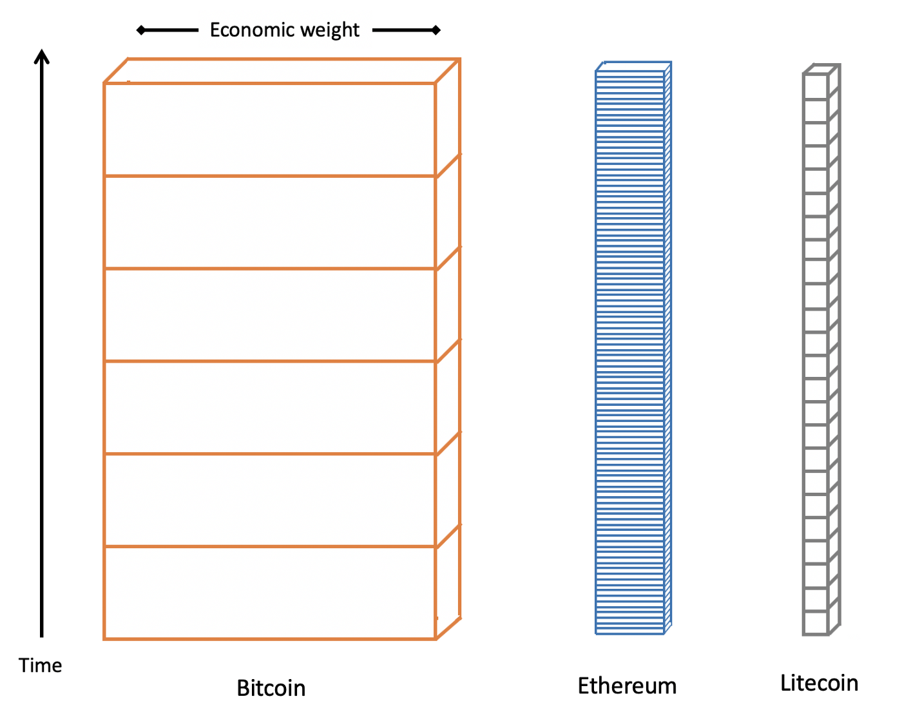
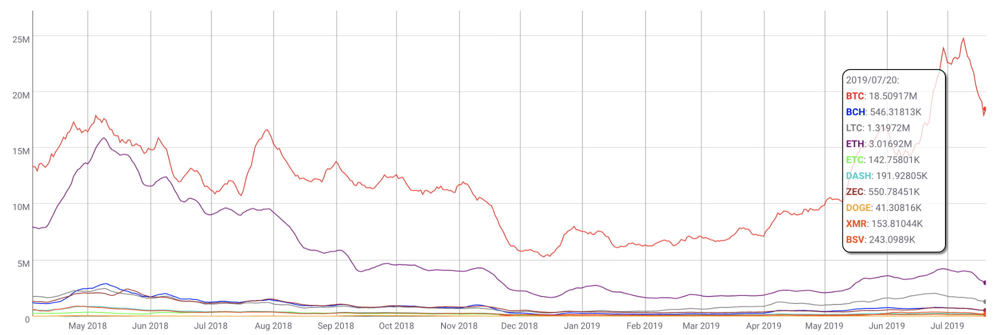
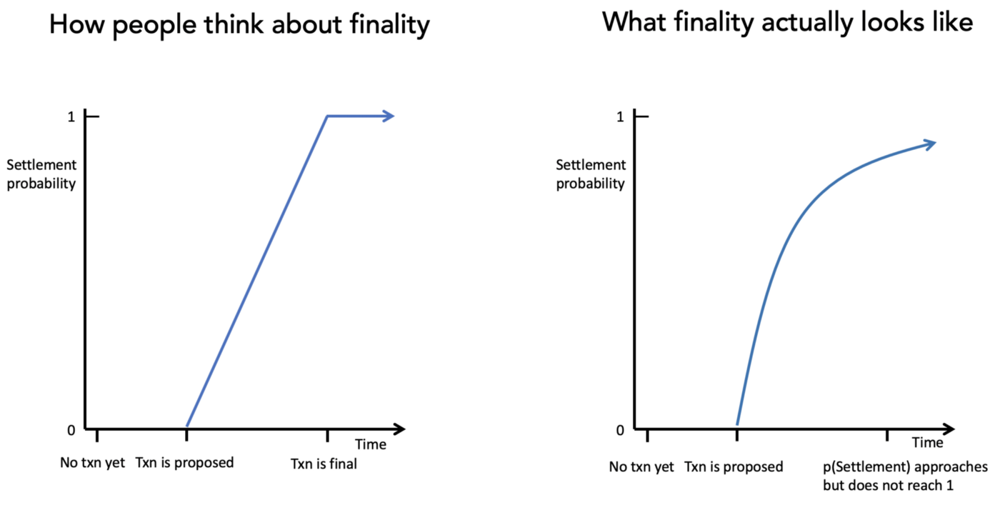

作者：[Nic Carter](https://medium.com/@nic__carter?source=post_page---------------------------)

原文：[It’s the settlement assurances, stupid](https://medium.com/@nic__carter/its-the-settlement-assurances-stupid-5dcd1c3f4e41)

译者：真好吃haichao

主流区块链的状态达到最终性需要多长时间？ 我需要等多久才能确认一笔比特币交易真正完成结算？ 有哪些风险因素可能会导致我需要额外的交易确认？ 交易确认的数量是如何影响交易结算的？

 令人惊讶的是，即使是在2019年，也就是在第一个比特币区块被开采后的10年后的今天，这些问题目前仍没有很好的答案。由于一些观点的存在，对于工作量证明机制的特性的严谨调查一直停滞不前。一些人认为工作量证明只是一个临时的机制，当更好的共识/抗女巫攻击机制出现后就会替代它。也有一些比特币原教旨主义的人会认为比特币的质量是不可被质疑的。 

但这些问题是至关重要的。 如果您认为具有开放验证节点集和分布式收敛机制的公链将在可预见的未来将持续为价值转移提供服务，那这些问题就是绝对值得深思的。 如果您是一个交易所，您的生计将依赖于正确评估各种区块链所需的交易确认的数量，这些问题会对您至关重要。 首先，让我解释一下为什么我认为结算保证是任何公链都值得考虑的首要因素。

## 比特币有趣在哪？ 

这其实是一个的难以回答的问题。 如果你去问十个不同的比特币用户，你会收到十个不同的回复。 关于比特币的用途和目的的分歧，几乎在2014-2017期间将整个社区分裂。 [Hasu](https://medium.com/u/90326a938400) 和我曾试图编写和总结过关于这些愿景上的[争论的历史](https://medium.com/@nic__carter/visions-of-bitcoin-4b7b7cbcd24c)。 也有其他人注意到了这一点，并且详细的记录了它们。 我尤其喜欢 [Murad Mahmudov](https://medium.com/u/e1c7b66721d6) 和 [Adam Taché](https://medium.com/u/f16a149f8471) 的[观点](https://hackernoon.com/the-many-faces-of-bitcoin-1c298570d191)。 Daniel Krawisz 也在 2014 年巧妙的[讨论了这个话题](https://nakamotoinstitute.org/mempool/the-two-ideologies-in-bitcoin/)。 

在 Krawisz 的文章中，他认为比特币中存在着两个观点非常不同的群体：投资者和创业者。 他认为，投资者觉得比特币是一种新形式的高能货币，主要目的是维护个人的主权。 他们倾向于认为比特币终将因其内在的货币属性而成为主流资产。 对他们来说，布道毫无意义：币价才是最好的布道者。 而“创业者”们，正如 Krawisz 所认为，会对比特币作为全球支付系统更感兴趣，并且更加关注其在商业中的应用。 正如任何在 2015-2017 关注过区块链的人都知道的那样，这两个阵营就比特币的目标这一话题进行了激烈的内战，这其中区块大小是两方争论的主要战场。 

我认为也许这些观点可以统一。 我倾向于认为比特币的有趣之处在于它能够使用通信媒介来进行价值转移，并且提供极强的交易保证。 （我曾经在[另外一篇文章](https://medium.com/@nic__carter/unpacking-bitcoins-assurances-a3c98824d3f0)中尝试展开解释和评估交易保证的意义）我认为比特币是一种新颖的[制度技术](https://medium.com/@hasufly/bitcoin-and-the-promise-of-independent-property-rights-8f10e5c7efa8)，它提供了高度被保证的财富储存和转移功能且不依赖于任何国家或金融体系。这将会为人类的组织模式开启新的篇章，并且将会让那些财产所有权制度得不到保障的地方有可能实现有效率的商业模式。 

因此，如果您认为交易的结算保证是这个系统中最有趣的事情，那我们应该如何评估它呢？ 我们应该如何在开放验证的前提下，在比特币和其他系统之间进行标准一致的比较呢？ 

## 结算的评估

那么究竟什么是结算保证呢？ 它指的是对于系统所收到的一笔交易，系统能够让该交易的接收方确信这笔交易不会被篡改的能力。 使用像 SWIFT 这样的消息传递系统的电汇非常主流，这是因为它们处理的交易实际上是无法被篡改的。 对于收件人来说 SWIFT 是安全的，因为只有在确认了发件人的帐户中的资金完整后，始发银行才会释放资金。

 这就是为什么[孟加拉国银行盗窃案](https://www.nytimes.com/interactive/2018/05/03/magazine/money-issue-bangladesh-billion-dollar-bank-heist.html)背后的小偷们选择了使用 SWIFT 和银行电汇：他们想要利用这些系统的交易结算保证。 换句话说，他们是选择了使用一种难以被篡改的系统来实施他们的盗窃。 这么做的结果是涉案的6100万美元至今仍然下落不明。 这并不是用来表明 SWIFT 和银行转账是失败的证据，相反这证明了这些系统所拥有的优势。 即使在这种情况下，几乎每个参与者都希望能够逆转交易，但他们却依然无法做到。 这说明该系统可以抵抗回滚，自由更改和事后编辑等操作。 这并不会使它成为一个糟糕的系统。 这反而使得它成为一个能够为交易对手提供了很好的保证的系统，保证交易最终必定将会被结算。 

比特币是一个类似的很有用的系统，因为它同样为用户提供了强大的结算保证。 只不过究竟有多好，我们还并不完全知道。 [LaurentMT](https://medium.com/u/1852b393b452) 在他出色的 [Gravity](https://medium.com/@laurentmt/gravity-10e1a25d2ab2) 系列中写出了也许是目前为止最为科学的一些探索。 但总的来说，比特币 PoW 的特性仍然尚未得到充分的研究。 它在历史上曾有过一些区块重组的事件，但据我们所知，这其中并没有以恶意偷盗为目的的重组发生过。 并且我们知道矿工们将大量的现实世界的资源输入给了交易的挖矿。 这意味着比特币交易的接收者可以怀有极高的信心，相信一旦其交易被埋在几个区块之下，交易就不可能被逆转。

但对于许多竞争加密货币而言，情况并非如此。 虽然在许多情况下它们看起来与比特币类似，但其实他们其中并没有一个和比特币具有相同的结算保证。 这不一定是因为任何设计缺陷，而仅仅是因为比特币的每个区块在每单位时间上累积了更多的成本（也就是攻击成本），并且也是因为比特币对于它的哈希函数来说是一个近乎垄断的角色，并且还拥有专用的硬件。 有些令人惊讶的是，许多较弱的链还尚未被尝试攻击过，即使这样做的成本很低。 这很可能是因为51％攻击后的套现需要利用交易所，这会带来些额外的复杂性。 而且坦率地说，大多数比较小的币在一开始的币价都比较低（并且也没有多少流动性可以用来做空），这就限制了攻击的收益。

 如果你想要了解众多加密货币的脆弱程度，你可以看看 [crypto51.app](http://crypto51.app/) 这个网站。该网站通过假设攻击者可以在 Nicehash 上租用足够的硬件来计算区块链被攻击的可能性，虽然有点不现实，但它仍然很好地指出了了攻击这些系统的成本的下限。 

那么评估公链系统中的结算效率的关键变量是哪些呢？ 让我们把它们分成易于量化的变量和难以量化的变量两部分来讨论。

 在我们开始之前，让我们先进行一丢丢的文献综述，引用这个领域的一些先前的工作： 

* 若想获得对于这个问题的更加简洁的描述，请阅读 [Anthony Lusardi](https://medium.com/u/8021fc666260) 的 [Understanding (and Mitigating) Reorgs](https://medium.com/@pyskell/understanding-and-mitigating-re-orgs-921c7768fa18)。 
* 有关比特币工作量证明的全面调查，请参阅：国际清算银行的 Raphael Auer 写的 [Beyond the doomsday economics of “proof-of-work” in cryptocurrencies](https://www.bis.org/publ/work765.pdf)。 
* 有关于包含一些变量的模型的具体实现，可以参考来自 BKCM 的Kevin Lu 写的 [A Lower Bound on Miner Rewards](https://bkcm.co/research/economicfinality.pdf)。 

## 可量化的结算相关变量 

### 记账成本 

记账成本是我们评估区块链结算保证时最有用和最直接的变量。 简单来说，它相当于**每单位时间支付给交易验证者/选择者的金额**。 在比特币中，矿工每挖出一个块都会获得区块奖励和交易费用，作为其保持诚实和“遵守规则”的激励措施。在工作量证明中，矿工会附上一个不可伪造的证据，证明他们已经消耗了一些能量，因此对于每个区块每个矿工都要付出相应的代价。 在每赢得一个区块的时候，除非他们非常幸运，矿工必须消耗大致相当于该区块价值的资源（这其中的边际利润通常很小）。 因此，矿工会被激励去创建有效且遵守规则的区块。 

你可以把它想象成一个学校作业，比如必须阅读一本书并制作书籍报告。 你需要向你的老师证明你读过这本书，所以你要制作一份读书报告（一个前缀中有足够数量的零的有效块哈希），只有当你你实际读过这本书（计算出足够的哈希值），你才能创建它。 因为你的老师是个刻板的人，你还必须正确地格式化你的读书报告（产生一个结构正确且有效的块）。 如果你阅读了整本书但只提交一个格式错误的报告，并以你得到 F 的分数作为收场，那将是非常悲剧的。工作量证明机制也是如此的：工作是需要预先进行的，收益只能在之后获得。 既然你已经承担了实际成本，而你的业务又需要你于你执行最后的几个死板的步骤来获取你的奖励，你并不会希望搞砸这部分。 最近就出现过类似的事情，有一名矿工完成了所有必要的工作并获得了提交一个区块的资格，但是在[最后一道关卡中却创造了一个无效区块](https://twitter.com/BitMEXResearch/status/1148989508588883970)。 

想要获得有关 PoW 奖励如何运作的更完整描述，请阅读 Hugo Nguyen 的文章：[The Anatomu of Proof of Work](https://bitcointechtalk.com/the-anatomy-of-proof-of-work-98c85b6f6667?source=post_page---------------------------)

那么为什么更高的每单位时间的记账成本意味着更高的安全性呢？ 因为如果（诚实的）矿工的工资更高，则意味着你需要雇佣个更多的唯利是图的人才能打败他们。 这些要消耗的资源必须来自某个地方：您需要管理能够产生哈希算力的硬件，电力等等。 （有一种观点认为，由于攻击者在进行51％攻击时会获得区块奖励，因此只有只有交易费才可以提供为 PoW 安全性。 在这里我没有足够的时间来充分讨论这一点，目前来说，我会认为区块链奖励，尤其是专用挖矿硬件，本身就是一个巨大的门槛，是必须在进行51％攻击理论讨论之前就要解决的问题。） 

总而言之，要想出价高于在比特币上尽职尽责地生产区块的诚实矿工们是非常困难的。 他们现在每年产生着69亿美元的收入，并且其中许多人可能会投资他们的产业中的其他业务以预期在未来获利（这意味着矿机可能有溢价，即区块链网络上正在挖矿的矿机的价格甚至可能高于其产生的价值）。

因此，比特币不仅接受来自比特币协议向矿工支付的日薪的保护，还会受到这些矿工期望在未来获得的折价收益的保护。 这意味着比特币不仅受到当今现状的保护，而且还受到矿工对未来奖励的期望的保护。 

这里我们并没有找到一种简单的方法来模拟预期，所以最简单的方法是获取**每单位时间的矿工收入并在此基础上来比较不同的区块链系统**。 到这里为止，如果你选择现在就停止阅读这篇文章并且只记住上一句话，那相比大多数人，你已经获得了对安全性更好的理解。 很少有团队，即使是那些像交易所一样高风险的项目，也很少像这样来评估区块链。 

幸运的是，[Anthony Lusardi](https://medium.com/u/8021fc666260) 已经就这个主题做了一些很好的说明性工作。 他介绍了Bitconf（ [Your Exchange Needs More Confirmations: The BitConf Measure](https://medium.com/@pyskell/your-exchange-needs-more-confirmations-the-bitconf-measure-872b69babc8f)）。 这个工作展示了，对于比特币上的一次交易确认来说，其他的区块链（比如莱特币）需要做多少次交易确认才能达到同样的价值。

但是，我敢说大多数人并不会使用 BitConfs，或尝试将对各区块链需要的交易结算成本进行索引。 恰恰相反，“民科”们认为结算是交易确认数量的线性函数。 更令人遗憾的是，这其实是一个非常普遍的观点。 即使是[莱特币基金会](https://litecoin-foundation.org/)网站也隐晦的表达这个观点： 

> 莱特币交易的确认比其他加密货币更快，比如比特币，因为它每2.5分钟产生一个块，而比特币是10分钟。 这意味着您的资金可以更快地被送达。 

如果是比较最初的从内存交易池中选取交易并包含到链中的时刻的速度，那莱特币是要快的多，但在加密货币中，概率性的交易结算效率是必须被纳入考虑的。 换句话说，如果你只关心第一次确认，那么莱特币“更快”，但是当你关心长期意义上的结算（多次确认）时，很明显它会慢得多。 

如果你认为莱特币和比特币的每次确认都提供了相同程度的结算保证，那么你可能会认为比特币显然更慢，并画出如下的一个图：

但这是错误的。 莱特币上每单位时间会产生更多的块，但它累积记账成本的速度会更慢。 实际上，比特币会为其矿工们提供更高的收入，因此他们每分钟会以哈希的形式提供更多的安全性。

与莱特币相比，比特币区块累积的成本会“更重”。 即使莱特币拥有10分钟的出块间隔，一个比特币的区块块仍然比一个莱特币的区块贵14.5倍。 确认的数量其实无关紧要， 矿工们每单位时间的机会成本才是最重要的。

 我们可以尝试将这个记账成本增加的过程可视化，随着区块的堆叠，交易会被埋在越来越多的区块之下，也就越来越接近它最终被结算的状态。

随着更多的区块被加进来，这笔交易也变得越来越难被逆转，交易结算也就更加接近完成的状态。 在这个图中，我按照记账成本的相对大小关系对区块的宽度进行了缩放，并画出了块的粒度。 

这里的要点是区块链系统中的结算是有一个过程的。 出块间隔基本上无关紧要。 以太坊每小时比比特币出的块更多，但应根据记账成本而不是确认数来比较两者之间的结算效率。 

### 逆转交易的收益：交易的金额 

记账成本并不是影响交易结算效率的唯一因素。 同样重要的是逆转交易成功后可能得到的收益。 衡量这种激励的最纯粹的方法就是依据交易的金额。 如果你是一笔50,000 BTC交易的接收人，你可能需要等待超过六个块的才会确认交易完成。 如果你是正在接收1000聪，那一次确认就足够了。 简而言之，每笔交易的结算都会或多或少受到其涉及的金额的影响。 

[Elaine Ou](https://medium.com/u/ff465e02dd82) 在一篇精彩的 [Bloomberg 文章](https://www.bloomberg.com/opinion/articles/2019-01-16/bitcoin-and-other-cryptocurrencies-are-open-about-being-at-risk)中正式确定了这一概念，认为收款人应该等到交易的价值和记账成本匹配时才能认为交易结算完成。 

Elaine 的公式巧妙地结合了区块链结算中两个最重要的可量化的变量：记账成本和逆转交易的收益。 如果你想在BTC结算价值1000万美元的收款交易，根据其规则，你需要等待60个区块，或者说10个小时。 （这是一个很巧妙的巧合，以13,330美元的价格计算的话，比特币会以100万美元/小时的速度累积记账成本）。 接下来，我会将这个简单的公式称为 **Ou 规则**。 

现在我们已经列举了两个最关键的结算相关的变量，让我们来进行一些计算并比较一下这些主流的 PoW 网络。

毋庸置疑，比特币是迄今为止结算最快的区块链（仅考虑这两个变量而言，且不考虑其他不太主流的区块链）。 在许多区块链上，即使是100万美元的收款交易，也可能非常缓慢。 除了比特币，以太坊和莱特币之外，其他的分布式账本们都需要花费至少一天的时间（在这些例子中我不包括 Ripple 和Stellar，因为它们并没有实际意义上的分布式验证）。 较小的链们则根本没有足够的矿工奖励来让结算能够在合理的时间内被完成。 

[Luke Childs](https://medium.com/u/d05136c145e5) 的 Howmanyconfs 提供了部分该表的动态的更新版本：[How Many Confs?](https://howmanyconfs.com/?source=post_page---------------------------)

同样值得注意的是，BCH和BSV的交易结算分别比比特币慢33和69倍。 虽然它们在功能上与比特币在大多数方面相同，但由于它们为矿工提供的奖励较少，因此它们的速度要慢得多。 这与他们作为“更快”的区块链的定位形成了鲜明的对比。 

这也是一个关于比特币如何抵制被模仿的有趣案例研究。 你可以创建一些看起来与比特币类似的东西，但是你无法复制基于记账成本产生的结算保证。 矿工们遵从现实的经济情况，他们不会被哄骗去支持一个不能很好地为他们提供收入的协议。 事实上，正如我们将要了解的那样，由于第三个变量的存在，BCH 和 BSV 的表现甚至比这个表展示的更加糟糕。

### **垄断其哈希函数**

到目前为止，我还没有提到第三个关键变量，它将直接影响某个区块链的结算保证：即它是否对能够进行其哈希计算的硬件具有垄断性。 正如我上面所提到的那样，BCH 和 BSV 相对于比特币来说处于一个巨大的劣势，因为它们只拥有所有 SHA-256 ASIC 的一小部分。 这意味着，即使是一个中型或小型的比特币矿池，也有可能会暂时将其算力指向比特币的较小分叉之一，并且随心所欲的对它进行 51％ 攻击。

这些区块链尚未受到攻击的事实并不能成为其安全性的证据。 可能的情况是，比特币上没有矿工愿意恶意骚扰今天的少数派，但是仅仅依赖于矿工的善意会导致其拥有一个极其脆弱的安全模型。 由于这种风险始终存在，因此可以认为，无论确认数量多少，这些区块链都不会产生有效的交易结算。 这是因为，例如，在比特币上就有着足够的矿池，可以轻松的对 BSV 进行一次深度为100多的区块重组。 

这个变量为本文的分析带来了更多的复杂性。 并不是说更多的算力就会意味着区块链更安全，它还必须占有该哈希函数对应的硬件的很大一部分才可以。

在这个例子中，即使区块链 B 拥有更多的记账成本，我仍然将假设区块链 A 的安全性低于 B，因为理论上找到足够的硬件来攻击 A 将会更加容易。 

所以我考虑认定这个变量是一个布尔值：即该区块链是否是其哈希函数的算力的垄断者。 如果它很不幸的与众多其他区块链共享挖矿硬件，并且只拥有很少一部分的矿机的支持，那它很可能从根本上来说就是不安全的。 但很难确定它究竟有多不安全，攻击的风险将取决于攻击者聚集足够的电力和硬件的能力。 

## 不太可量化的结算变量 

上面所涉及的三个变量并非详尽无遗，它们只是最容易量化的变量而已。 有了这些变量，你可能就已经可以建立一个比今天许多交易所使用的更好的模型。 但仍有许多因素需要考虑。 

### 逆转交易的收益：金手指攻击 

金手指攻击的名字取自邦德电影，电影中的恶棍计划辐射诺克斯堡的所有金币来使他自己所拥有的金币更值钱。 这个名词用来描述一些攻击者受到一些协议之外的激励的这类攻击。 Joseph Bonneau 更科学地将其[描述](https://fc18.ifca.ai/bitcoin/papers/bitcoin18-final17.pdf)为“攻击者有着破坏共识过程的外在动机”的攻击。 

这种攻击的风险几乎无法量化，因为攻击者有各种不同的动机，并且往往不是先验的（在攻击之前透露）。 在这里，我将进一步给出两个例子，它们会让逆转交易的收益率会急剧增加，并且使得结算保证变得不那么确定。 

### 上层过重

这是指在一些基础层协议之上创建大量价值很高的资产作为 Token 的情况，例如比特币上的 Omni 资产或以太坊上的 ERC20 资产。 由于这些 Token 的安全性来源于其 Layer 1 并且完全依赖于 Layer 1 来运转，因此它们在 Layer 1 上会很容易受到攻击。

随着底层协议的攻击成本和上层资产价值这两者之间的不对称性的日渐凸显，上层过重的问题也会开始显现出来。 当这种不对称性变得足够大，攻击者可能会寻求机会做空在上层的某些资产并同时攻击底层协议，挖取空块并对相关 Token 进行 DOS 攻击，或者进行重组和混淆。 

现实世界中是有着有关上层过重问题的后果的例子的。 最近已经有攻击者尝试了一些方法可以用来[攻击 BitMEX 上的衍生品的参考价格](https://www.theblockcrypto.com/tiny/bitcoin-price-on-bitstamp-crashed-by-nearly-20-in-11-minutes/)。 由于 BitMEX（上层）的抵押品和底层参考市场（底层）之间存在很大的不对称性，因此可以通过在 Bitstamp 上倾销现货，使 BitMEX 上的保证金头寸被清算，并以此获利。（译者注：即在 BitMEX 上开100倍的空单，然后在 Bitstamp 上砸现货，以此在 BitMEX 上获利）

我虽然不认为现如今的任何区块链会面临这个问题，但随着更多的资产被 Token 化并部署在区块链之上，攻击基础层的回报将会显著增加。 

### 有流动性的衍生品市场

这个就比较直观了。 衍生品，特别是期权，使金融市场参与者能够获得杠杆并放大他们的回报，即使底层证券仅有小幅波动也是如此。 在上层过重的问题下，当实施攻击的成本与攻击的收益之间存在显着的不对称时，区块链金融的风险就会出现。 

衍生品市场的建立让攻击这能够放大他们通过预测价格变动所获得的回报；如果他们可以通过发起攻击来诱导资产价格下跌，那么该区块链系统的结算保证可能会存在风险。 随着攻击的收益增加，攻击者愿意为攻击而消耗的资源量也会增加。 因此，可以用来做空的杠杆的存在可能会削弱一个区块链的结算保证水平。 但是由于攻击者自身的不同，以及他们在完成攻击后进行套现的能力的不确定性，量化这种风险并为安全模型增加定量的折损是不现实的。 

当然，这里的一个平衡因素是，如果交易所怀疑某交易的交易者在与攻击者协助共同干扰区块链，那么他们可能不愿意轻易的去冒险纵容这笔交易。 

### 硬件相关的考虑

之前提到的关于挖矿专用硬件的讨论也已经充分的说明了 GPU 挖矿的币是不可能成为硬件上的垄断者的，这是因为世界上有着足够多的 GPU（得益于游戏和一些其他非加密货币的应用）。 我在此不会特别强调这一点，因为 [David Vorick](https://medium.com/u/49f73e8059c4) 已经清楚地[阐明](https://blog.sia.tech/choosing-asics-for-sia-b318505b5b51?source=post_page---------------------------)了为什么 GPU 挖矿的区块链基本都会面临风险，以及为什么设置长期激励（以ASIC形式）是如此重要。

因此对于 GPU 挖矿的币和区块链应该总是进行额外的交易确认。 虽然一单位的 GPU 挖矿成本和一单位的 ASIC 的挖矿成本之间的比例是很难被确切的计算出来的。 但由 GPU 挖矿生成的安全性是必须要被打一个折扣的。 毕竟获取 GPU 挖矿的硬件实在是太简单了。 

## 案例研究：Kraken 的交易确认要求 

令人惊讶的是，即使对于交易所来说，这类交易结算规则制定上的失误会让他们产生较大的损失。但从我与他们的谈话中来看，他们好像对于交易确认的相关机制并不怎么关心。 我没有找到很多的关于交易所在交易被结算前需要等待多少个确认的相关信息。 但还好 Kraken 将他们的[标准公开了出来](https://support.kraken.com/hc/en-us/articles/203325283-Cryptocurrency-deposit-processing-times)。 

我决定将 Kraken 的交易确认的相关规则与 Lusardi 的 BitConf 的一个简单实现进行对比，即要求所有的链都提供与比特币的六次确认等价的交易保证：

结果把我吓坏了。 取决于你具体怎么看，要么 Kraken 就是对比特币交易要求是极其严格的，要么它是对非比特币链的要求是极其宽松的。 虽然 Kraken 对于比特币交易要求有6个区块确认才算结算完成，但对于莱特币只要求12个区块确认（与比特币同等安全性的情况下应该需要174个），对于以太坊只要求30个（与比特币同等安全性的情况下应该需要173个），对于门罗币只要求15个（而与比特币同等安全性的情况下应该需要2000个）。 

我的猜想是也许六次确认对于比特币来说有些太多了，而 Kraken 对其他链的较少结算要求其实会更加合理。 但不管怎么说，控制了记账成本这个变量了之后得到的这个结果还是有点搞笑的。 比如如果 QTUM 与比特币采用同样的评价标准，则需要67,000个区块确认才行，这相当于115天的等待时间。 （QTUM 可能会有一些其他我不太熟悉的结算模式，我这里的数字仅仅是根据它给区块验证人支付的钱数所计算出来的）。 

当然这仅仅是该模型的一个非常简单的实现。 一个更加复杂的版本应该包含对于“非垄断链”的高安全要求，GPU 挖矿的币以及接收金额较大的交易等等。 我会建议像 Kraken 这样还没有开始系统性的考虑交易结算准则的交易所们做出一些改变。 但无论选择怎样的标准，它们都应该会对比特币要求更少的交易确认数量，而对其余更小的链要求更多的交易数量。 

## 一些关键点

这一切究竟有什么实际意义？ 尽管我们还需要一些工作，才能将这些变量组合成一个可以用于加密货币的日常应用的模型，我们现在已经可以总结出如下一些关键点： 

### 1. 出块间隔是变动的，但变化很小 

出块间隔减短唯一会影响的事情，就是交易获得其首次确认的时间。 如果你并不那么有耐心，你可能会更喜欢2.5分钟的出块间隔，但这并不代表交易的结算更快。 作为一个币的发行数量和单价的函数，记账成本始终还是按照那个速度在累积。 

比特币的确是可以将它的区块大小减少25％并换成2.5分钟的出块间隔，并且几乎没有人会注意到其差异。 系统在功能性上是完全一致的，只不过六区块法则变成了二十四区块法则。 Satoshi 选择了10分钟的出块间隔，是因为他当时并不知道系统能够收敛到何种的程度。 网络延迟和大区块会干扰验证，并使节点之间的收敛更加困难。（译者注：当系统网络情况较差时，区块往往不能被很好的广播到全网所有节点，链上会出现较多的分叉和叔块；相反当网络情况较好时，区块广播更加完全，链上会出现较少的分叉和叔块，各节点认的主链也会更一致，整个网络更加收敛） 10分钟这个健康的出块间隔为系统提供了充足的时间，并且还让我们了解了 Satoshi 当是想构建的是个怎样的系统（提示：并不适合面对面的小额支付）。 

对于一些小额交易来说，第一次确认确实有点用，因为只有当你的交易被包含在了一个区块中被挖出后，才能被后续区块压在身下。 而且较小的出块间隔可以减少每日增发量的浮动。 但除此之外，出块间隔可以是完全任意的。 对于结算来说，每单位时间的安全支出才是除了记账成本质量之外的关键问题。 较小的出块间隔只是把安全性累积的过程的颗粒度分割的更小而已。 它并不会让结算完成更快。 

### 2. 要么是比特币提供的安全性过多了，要么是其他区块链正处于危险之中 

这是能从本文的各种比较之中能看出的最明显的结论了。 如果你只是按照每单位时间支付给交易选择者们（矿工或区块验证者）的薪水来衡量区块链安全性的话，那么在大多数情况下，它们与比特币相比是非常脆弱的。 这从这张图表就能看的出来。 除了比特币，以太坊和莱特币，图表上几乎看不清其他任何链。这是因为他们的在安全性方面的支出实在是太少了。

当然这不一定是致命的。 也有可能是比特币在安全方面的支出有点过多了，工作量证明机制比我们想象的“还好”。 这实际上是我目前的看法，考虑到目前的区块奖励和高币价，比特币也许在安全性方面的支出有些“过量”了。 但这的确让它被包裹在了一个温暖的毯子里，让它在进入它的青年时期时有一个很好的保护。 

所以对于较小的区块链来说，这些数据不一定代表了末日降临。 毕竟，尽管 Satoshi 制定了六块法则，但对于大多数交易来说，1个或2个块就已经足够了。 这将减轻那些试图赶上比特币的安全支出的区块链的重负荷。 

### 3. 结算始终是概率性的 

我承让每当新的区块链吹嘘他们交易“绝对最终性”的时候我都会稍微怼那么一下。 真正能够获得交易最终性的方法是让某个组织进行交易担保并有效的支持交易。 但是当这种情况发生时，那些希望交易回滚的主权机构（比如当他们怀疑其中涉及犯罪活动时）通常都会要求该担保组织对交易进行回滚，在看起来已经达到的最终态上戳一个洞出来。

我们用 EOS 来举个例子。 根据 EOS Canada 提供的信息，EOS 有一个名为 [Last Irreversible Block](https://www.eoscanada.com/en/abc-eos#lib) （LIB） 的概念，

> 它指的是你可以用100％的信心相信该交易是达到了[最终态](https://www.eoscanada.com/en/abc-eos#finality)的，是被完全确认了和[不可改变](https://www.eoscanada.com/en/abc-eos#immutable)的。 如果某个交易对应的[区块](https://www.eoscanada.com/en/abc-eos#block)高度低于了 Last Irreversible Block （LIB）的区块高度，这就说明这笔交易被认为是达到了最终态了的。 

根据 [EOS Network Monitor](https://eosnetworkmonitor.io/) 显示，目前的 LIB 区块前面有330 个区块, 相当于大概2分40秒。 这表示 EOS 所声称的结算时间非常短。 

但这里有一个问题。 EOS （曾经？）有一个这样的政府流程：个人可以通过该流程向“EOS 核心仲裁委员会（ECAF）”申请冻结或者返还被偷的币。这个流程可以有效的逆转很久以前就被结算了的交易。 这样的交易逆转在2018年6月的时候曾[发生过一批](https://www.coindesk.com/eos-blockchain-arbitrator-orders-freeze-of-27-accounts)。 由于当时只有21个实体（出块人）负责处理交易，并且他们都有可被追责的领导人，所以这个流程在当时是可能的。 

也许很多旁观者们会为被盗资金归还这样的事情起立鼓掌，但从交易结算的角度来看，这会让区块链丧失一些用户们对该区块链的所重视的品质。 在实践中，任何可以实现交易逆转的机制都可能会被滥用。 正是因为退款欺诈行为的猖獗，信用卡才在交易中加入了一些交易费用。

可以想象一个稍微复杂点的骗局，比如有人在 P2P 交易中卖出了一些 EOS，然后将该交易投诉到 ECAF，说自己受到了诈骗，并要求返还其 EOS。 这就是一种行政手段干预而导致的结果。 

这样的例子还有很多，在这里我先仅提供这一个作为示例。 实际上有许多的区块链都会声称他们拥有完整且有效的获得交易最终性的方法，但又同时增加了能够自主回滚交易和冻结账户的方法在他们的系统之中。 这时你仍然需要去考虑交易被逆转的可能性，即使它并没有被明确的编码进系统当中。 

### 4. 比特币透明的 PoW 机制公开了其安全评价模型 

再引用一次 [Elaine Ou](https://www.bloomberg.com/opinion/articles/2019-01-16/bitcoin-and-other-cryptocurrencies-are-open-about-being-at-risk) 的话, 比特币的安全模型的最有用的特点之一，就是它的透明和易于理解。 交易保证虽没有办法被精确的度量（“多少个确认才能结算一笔10亿美元的交易？”），但是计算为支持系统而花费的资源却很简单。 在任何时候，任何人都可以轻易的算出需要多少算力才能操纵这个系统（通过做一些粗略的假设）。 这么多年来，已经形成了一个很明确的事实，那就是除了国家队以外，没有任何一个实体可以拿出足够的资源来战胜比特币系统中诚实的大多数。 

相比之下，其他的区块链通过对其设计的含糊其辞，或者是一些不透明的最终性机制，来将其安全模型隐藏在其复杂性之下。 比如 Verge 在它的工作量证明机制中集成的五种哈希函数就成了[压死骆驼的最后一根稻草](https://www.coindesk.com/verges-blockchain-attacks-are-worth-a-sober-second-look)。 一个攻击者发现可以通过针对其中的一个哈希函数“定时攻击”进行来将挖矿难度降低到1。 相比于为系统提供更高的安全性，引入的复杂性反而为系统带来更多的攻击面。 

## 总结 

以下是我认为这篇文章的一些关键点。 千万不要将一笔交易在工作量证明机制中的结算过程简单看作是交易确认数量的函数，而要将它看成是一个类似木材石化一样的缓慢过程。 它会以一个给定的速率进行，并且无法被加速。 这个速率由上面所列举的那些变量决定：主要包括记账成本，交易大小和获取其挖矿硬件的难度。 一旦结算完成，木材将完全被矿物质给替换并且变得坚如磐石，而不是像原来一样柔软和可塑。 关于这块木材的特征将被永远的保留。 

类似的，正如 Nick Szabo 所说，区块链是[可以进行计算的琥珀](http://typical%20computers%20are%20computational%20etch-a-sketch%2C%20while%20blockchains%20are%20computational%20amber./)。 琥珀出生时仅仅是树的汁液，后来才慢慢变硬，并且在这个过程中存储了一些信息（比如昆虫 DNA等）。 将过去对于账本的变更掩埋在不可伪造的成本证明之下的这个过程，同样提供了缓慢增长的交易结算保证。 随着越来越多的区块累积，区块链的“重力”开始发挥其作用，并使很久之前的交易的重写变得非常的昂贵和笨重。 

矿工获得奖励（成本的来源）取决于币的发行数量，单价和交易手续费用。 这其中除了发行之外，都是不可被编程的。 仅凭一个比较高的发行量是不能保证安全性的，必须要有投资者们为这条链的未来买单并且支持它的价值。 从这个意义上说，工作量证明制度提供的强交易保证是无法被设计出来的，它们只能自行出现。 这是否是个令人沮丧的结论，就取决于你怎么看它了。 

本文中，我尝试列举出那些影响区块链交易结算保证的关键变量，尤其是那些基于工作量证明的变量。 但你应该注意到了我并没有提供任何正式的模型和推荐的解决方案。 这其中许多变量并不容易被量化，也可能有一些我遗漏掉的变量存在。 也许在我之后的下一位作者能提供一个更加全面，或者是更注重于实现的模型。 

如果我们今天忽视这些问题，在未来我们一样会被迫去面对它们。 随着市场上逐渐增多的做空流动性，全新的攻击类型将会随之出现，交易所们也会发现它们渐渐成为众矢之的。 同样的，由于一些主流托管机构和清算机构开始接受总计数亿或数十亿的加密货币存款，他们也需要开始制定正式的结算规则。 他们将更加竭尽全力的去深入思考它们所依赖区块链的安全性。

> 感谢 Toya 主编～也感谢迪波，Williams，肖杰等小伙伴们做出的贡献。
